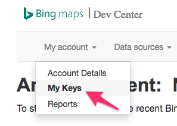
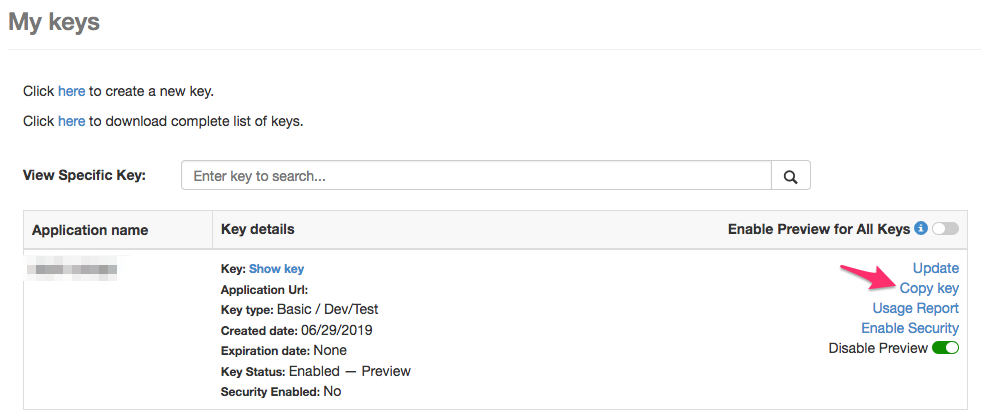

# Local Vicinity Entity Intersection Tool
Uses the Bing Maps API to identify locations where two categories of entities are in close proximity to each other. 

For example, finding all Shell gas stations (specific) with a sushi restaurant (nonspecific) nearby. Y'know, for those 
special, spontaneous moments in your life. 

## Usage
### Installation
Clone this repo, then install the package as a library in your python environment
```
git clone https://github.com/d-tork/drager-mapsule.git
cd drager-mapsule
python3 -m venv venv
source venv/bin/activate
python -m pip install .
```

### Configure your Bing Maps API key
[Get yourself a basic key.](https://www.microsoft.com/en-us/maps/create-a-bing-maps-key#basic)

Once you have it, copy it like so





And paste it in the `config/keys.yaml.template`, then rename that file `keys.yaml`.

### Plug away
See the `vicinity/__main__.py` file for an example, which could also be done in a Jupyter
Notebook as like as you `pip install` this package in your conda environment before launching
Jupyter Notebook/Lab.

The `VicinityCalculator` class writes a dataframe of raw results for each entity, plus the 
final calculated distance matrix to files located in the `data` folder as CSVs.

## Bing Maps API documentation
[Local Search](https://docs.microsoft.com/en-us/bingmaps/rest-services/locations/local-search) - returns a list of 
business entities centered around a location, made by either specifying a list of types (see below) or a query.

[List of available Type Identifiers](https://docs.microsoft.com/en-us/bingmaps/rest-services/common-parameters-and-types/type-identifiers/) -
types of businesses by which you can search, e.g. `EatDrink`, `BanksAndCreditUnions`, `Hospitals`, etc.

## Usage notes
`maxResults`: it seems like there is an artificial cap of **25** on this parameter, at least in `LocalSearch`. 
Requesting anything above this results in a 400 (Bad Request) response. This may be a limitation of the free API key.